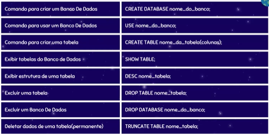

# Fundamentos de Banco de Dados

## O que é Banco de Dados?
É uma coleção de dados que se relacionam e representam informações sobre um domínio específico.

**Exemplos:**
* Informações de uma lista telefônica.
* Banco de colaboradores em um departamento.
* Registro de pedidos de um e-commerce.

### Qual o objetivo da criação?
Reduzir os custos de trabalho de armazenamento, organização e indexação de dados e arquivos, substituindo processos manuais e físicos por digitais eficientes.

---

## O que é SGBD?

**SGBD** (Sistema de Gerenciamento de Banco de Dados) é o software que possui recursos para manipular os objetos e os dados do banco, além de interagir com o usuário.

### Diferenciando as Siglas:
* **SGBD:** O software usado para manipular e escrever códigos (Ex: MySQL, PostgreSQL).
* **BD:** A tecnologia/armazenamento dos dados em si.
* **SBD:** Sistema de Banco de Dados. É o conjunto completo: **SGBD + BD = SBD**.

### Objetivos do SGBD:
* **Integridade e Segurança:** Garantir que os dados sejam válidos e protegidos.
* **Disponibilidade:** Permitir que vários usuários acessem os dados simultaneamente sem conflitos.
* **Consistência:** Evitar que informações conflitantes sejam armazenadas.

---

## Tipos de Bancos de Dados

### 1. Relacionais (SQL)
Organizam e armazenam dados em **tabelas** (linhas e colunas). Cada tabela representa uma entidade, e elas se conectam através de relacionamentos.

* **Chaves:** As tabelas são unidas através de uma **Chave Primária (Primary Key)** e uma **Chave Estrangeira (Foreign Key)**.

**Exemplo de Tabela:**
| ID (PK) | NOME     | IDADE |
| :------- | :------- | :---- |
| 1        | Vinicius | 18    |
| 2        | João     | 22    |
| 3        | Jeferson | 23    |
| 4        | Victor   | 19    |

### 2. Não Relacionais (NoSQL)
Não utilizam o modelo de tabelas fixas para armazenar informações. São altamente escaláveis e flexíveis, divididos em 4 categorias principais:

* **Chave-Valor:** Armazena dados como pares (Ex: Redis).
* **Documentos:** Armazena dados em formatos como **JSON** (Ex: MongoDB).
* **Grafos:** Focado em relacionamentos complexos usando nós e arestas (Ex: Neo4j).
* **Colunas:** Armazenamento otimizado para grandes volumes de colunas (Ex: Cassandra).

> **Caso de Uso:** Empresas como **Netflix, LinkedIn e PayPal** utilizam diversos tipos de bancos de dados simultaneamente para cruzar diferentes tipos de informações (Persistência Poliglota).

### 3. Tipos NoSQL

---
## Linguagem SQL
Para usar um banco de dados relacional é preciso de uma linguagem de consulta, e a **SQL** (Structured Query Language) é a mais usada atualmente para esta finalidade. Seus comandos são divididos em categorias principais:

* **DDL (Linguagem de Definição de Dados):** São comandos utilizados para definir e modificar a estrutura do banco, incluindo bases de dados, tabelas, índices e relacionamentos. 
  * *Exemplos:* `CREATE DATABASE`, `CREATE TABLE`, `ALTER TABLE`, `DROP TABLE`.
* **DML (Linguagem de Manipulação de Dados):** São utilizados para manipular os dados/registros dentro das tabelas. Esses comandos não alteram a estrutura da tabela, somente as informações salvas. 
  * *Exemplos:* `INSERT`, `UPDATE`, `DELETE`, `SELECT`.
* **DCL (Linguagem de Controle de Dados):** Comandos usados para gerenciar permissões, segurança e controle de acesso de usuários no banco. 
  * *Exemplos:* `GRANT`, `REVOKE`.
* **TCL (Linguagem de Controle de Transações):** Comandos usados para gerenciar as alterações feitas por comandos DML, garantindo que as operações sejam salvas com segurança ou canceladas em caso de erro.
  * *Exemplos:* `COMMIT`, `ROLLBACK`.

### 📑 Principais Comandos DDL

### 📑 Principais Comandos DML

---
### Constraints (Restrições)

As **Constraints** são regras aplicadas às colunas de uma tabela para garantir a integridade, consistência e confiabilidade dos dados. Elas impedem que valores inválidos ou incorretos sejam inseridos, mantendo a organização correta do banco.

* Servem para evitar erros e duplicidade de dados.
* Ajudam a definir restrições como valores únicos, campos obrigatórios e relações entre tabelas.

| Tipo | Como podemos usar / O que faz |
| :--- | :--- |
| **PRIMARY KEY** | Identifica cada registro da tabela de forma única. Não aceita valores nulos ou duplicados. |
| **SERIAL / AUTO_INCREMENT** | Gera valores numéricos automáticos sequenciais (1, 2, 3...). *Nota: No PostgreSQL, usamos o tipo `SERIAL` para isso.* |
| **NOT NULL** | Impede que a coluna fique vazia, tornando o preenchimento obrigatório. |
| **UNIQUE** | Garante que todos os valores em uma coluna sejam diferentes (Ex: e-mail ou CPF). |

**Exemplos Práticos:**
* `id SERIAL PRIMARY KEY` : Cria um ID que gera números automáticos sequenciais como chave primária (Padrão do PostgreSQL).
* `nome VARCHAR(30) NOT NULL` : A coluna de nome torna-se obrigatória e não pode ficar vazia.

---

### Tipos Primitivos (Tipos de Dados)
Definem o formato e a maneira como os dados são armazenados no banco de dados. Eles garantem que as informações sejam organizadas corretamente e otimizam o desempenho das consultas.

| Tipo | Descrição | Exemplo |
| :--- | :--- | :--- |
| **INT / INTEGER** | Números inteiros padrão (médios). | `25`, `1050` |
| **BIGINT** | Números inteiros muito grandes (usado para IDs ou sistemas gigantes). | `9000000000000000` |
| **DECIMAL / NUMERIC**| Números decimais exatos (ideal para valores monetários/dinheiro). | `10.50`, `1450.99` |
| **CHAR(N)** | Texto de tamanho **fixo**. Se você definir `CHAR(10)` e salvar 'OI', o banco preencherá o resto com espaços vazios. | `CHAR(2) -> 'MG'` |
| **VARCHAR(N)** | Texto de tamanho **variável**. Se você definir `VARCHAR(50)` e salvar 'OI', o banco gastará espaço apenas para as 2 letras. | `VARCHAR(100) -> 'Contato'` |
| **DATE** | Armazena apenas a data (Ano-Mês-Dia). | `2026-05-15` |
| **TIMESTAMP** | Armazena data e hora completas. | `2026-05-15 14:30:00` |

