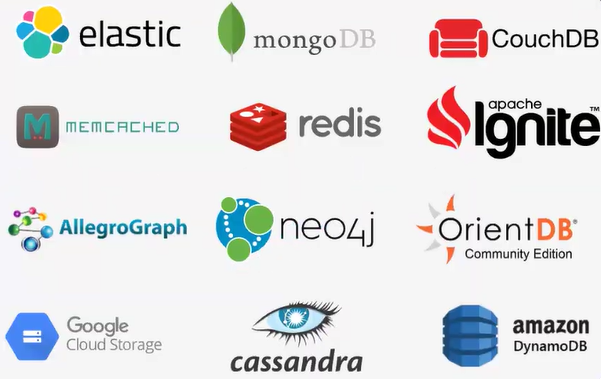

# Fundamentos de Banco de Dados

## O que é Banco de Dados?
É uma coleção de dados que se relacionam e representam informações sobre um domínio específico.

**Exemplos:**
* Informações de uma lista telefônica.
* Banco de colaboradores em um departamento.
* Registro de pedidos de um e-commerce.

### Qual o objetivo da criação?
Reduzir os custos de trabalho de armazenamento, organização e indexação de dados e arquivos, substituindo processos manuais e físicos por digitais eficientes.

---

## O que é SGBD?

**SGBD** (Sistema de Gerenciamento de Banco de Dados) é o software que possui recursos para manipular os objetos e os dados do banco, além de interagir com o usuário.

### Diferenciando as Siglas:
* **SGBD:** O software usado para manipular e escrever códigos (Ex: MySQL, PostgreSQL).
* **BD:** A tecnologia/armazenamento dos dados em si.
* **SBD:** Sistema de Banco de Dados. É o conjunto completo: **SGBD + BD = SBD**.

### Objetivos do SGBD:
* **Integridade e Segurança:** Garantir que os dados sejam válidos e protegidos.
* **Disponibilidade:** Permitir que vários usuários acessem os dados simultaneamente sem conflitos.
* **Consistência:** Evitar que informações conflitantes sejam armazenadas.

---

## Tipos de Bancos de Dados

### 1. Relacionais (SQL)
Organizam e armazenam dados em **tabelas** (linhas e colunas). Cada tabela representa uma entidade, e elas se conectam através de relacionamentos.

* **Chaves:** As tabelas são unidas através de uma **Chave Primária (Primary Key)** e uma **Chave Estrangeira (Foreign Key)**.

**Exemplo de Tabela:**
| ID (PK) | NOME     | IDADE |
| :------- | :------- | :---- |
| 1        | Vinicius | 18    |
| 2        | João     | 22    |
| 3        | Jeferson | 23    |
| 4        | Victor   | 19    |

### 2. Não Relacionais (NoSQL)
Não utilizam o modelo de tabelas fixas para armazenar informações. São altamente escaláveis e flexíveis, divididos em 4 categorias principais:

* **Chave-Valor:** Armazena dados como pares (Ex: Redis).
* **Documentos:** Armazena dados em formatos como **JSON** (Ex: MongoDB).
* **Grafos:** Focado em relacionamentos complexos usando nós e arestas (Ex: Neo4j).
* **Colunas:** Armazenamento otimizado para grandes volumes de colunas (Ex: Cassandra).

> **Caso de Uso:** Empresas como **Netflix, LinkedIn e PayPal** utilizam diversos tipos de bancos de dados simultaneamente para cruzar diferentes tipos de informações (Persistência Poliglota).

### 3. Tipos NoSQL

